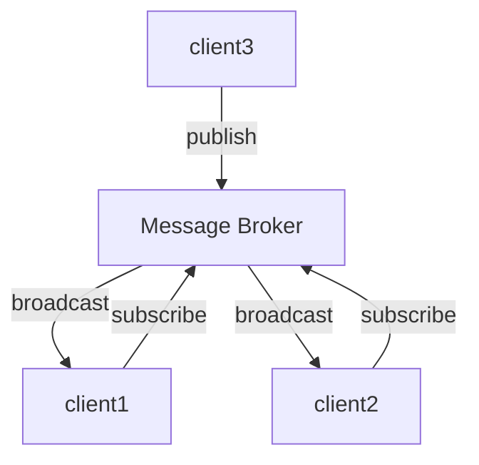

## Description



根據上圖實現出對應的 `Message Broker` 與 `Client` 模組，使任意 goroutine 能夠透過 message broker 廣播消息給其他 goroutines

## File Structure

```text
message-broker/
 ├─ pkg/          # 共用模組
 |   ├─ broker/      # Message Broker 模組
 |   ├─ packet/      # 訊息封包模組
 |   └─ sdk/         # Client SDK 模組
 └─ main.go       # 程式進入點
```